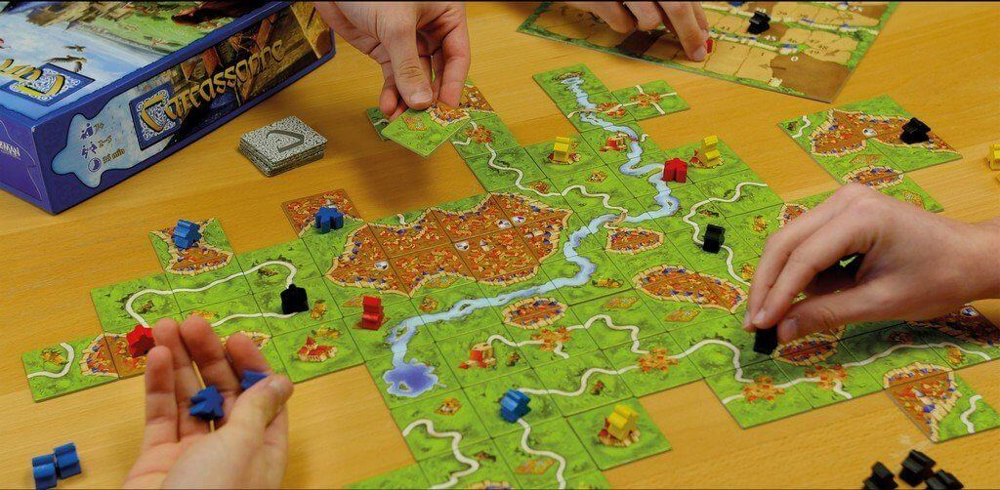
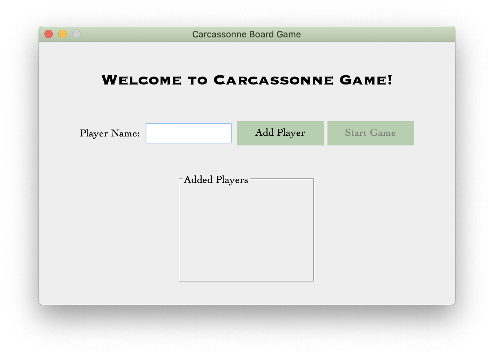
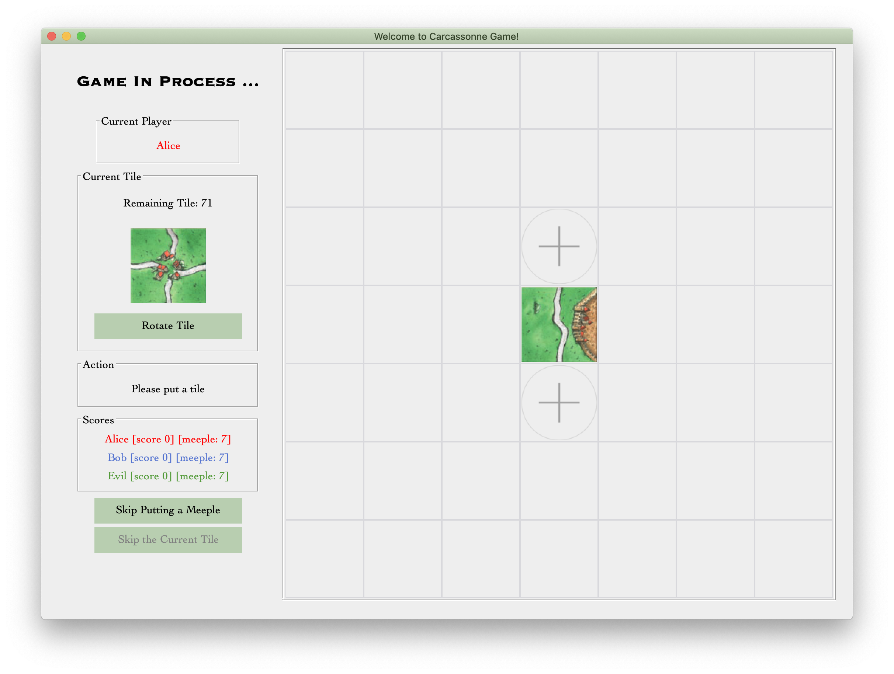
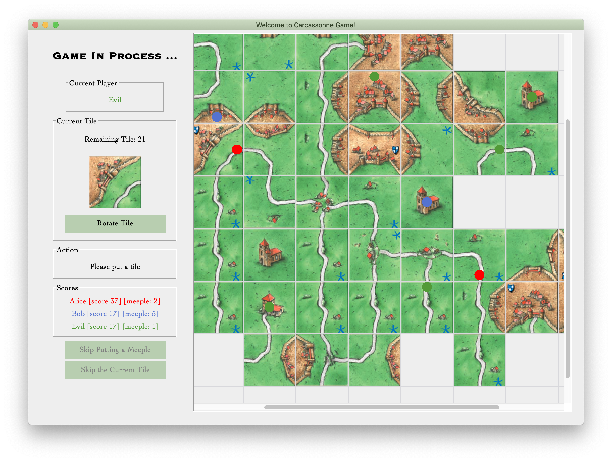
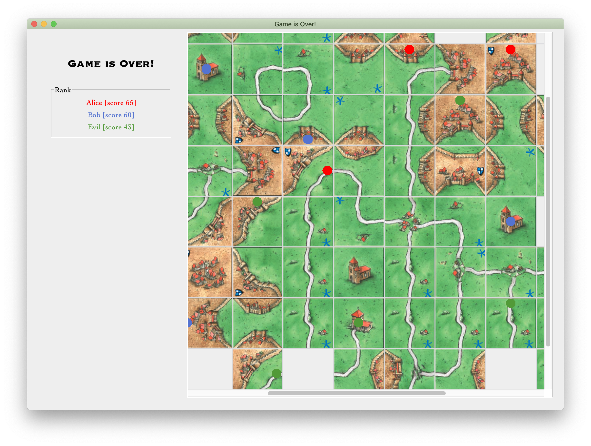
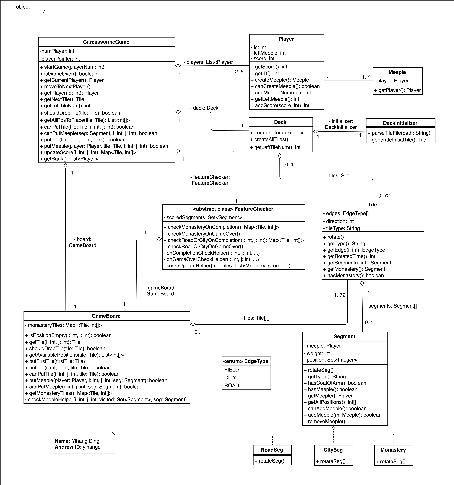

In this individual project, the calssical board game [Carcassonne](https://en.wikipedia.org/wiki/Carcassonne_(board_game)) is designed and implemented in Java.

The project is a course project of CMU 17-514, which is mostly about object oriented design and Java software design. The project contains a full cycle of software design and development, which means it also involves GUI design/implementation, testing and deployment.

**Note**: due to the CMU academic integrity rules, the project codes cannot be publicized.

## Game Overview
Once you run the program, you will first be required to enter the number of players:



You are required to enter names of all palyers. The number of players should be between 2 and 5 (both inclusive).

Say now we have three players: Alice, Bob, and Evil. Then we start the game.


Below is the main interface of the game:



In the real board game, there exists a deck and each player is supposed to get a tile from the top of the deck in turn, and then put the tile on the game board accordingly. We aslo simulate the real game experience through the GUI design:

- **Current Player**: the player who is supposed to get a tile from the deck and put it on the game board;
- **Current Tile**: the tile on the top of the tile, which is assigned to the current player. It can be rotated (90 degree, clockwise) by clicking the button "Rotate Tile";
- **Action**: action which the current player needs to take right now. It could be:
    - "Please put a tile": the player now should place the tile on the board. The tile may be rotated by the player. The "+" sign on the grid represents the positions that the tile can be placed on if the tile will not be rotated anymore;
    - "Please put a meeple": the player now should put a meeple on the tile which is just previously placed on the board. Once a meeple is placed, a small solid circle is drawn on the board, in the same color of the player's name. If a pattern is completed, meeples on that pattern will be revoked.
    - "Please skip puuting a meeple": if will happen if there are not any available positions, or the current players has no meeples right now. In this case, the player should click the button "Skipping Putting a Meeple" below to finish the current round.
- **Scores**: real-time scores and number of available meeples for each player.

Note it is also possible that a tile cannot be placed on any positions, even if it is rotated. In this case, simply click the button "Skip the Current tile" to drop the current tile and get the next tile.

The picture below is a screenshot of the main interface. The grid will automatically extend if necessary.



Once all tiles are used (dropped or placed), the game is over, and the final ranking will appear on the sidebar.



## Software Design and Patterns

In a Java project, it is highly important to use some suitable design patterns and some strategies, in consideration of robostness, flexibility and extensibility.

### Design Goal

The design goal in this project is to construct a comprehensive system that contains all concepts in the game and is able to execute all operations during the game. It should also correctly records the state of the game and return the correct results once the game is over.

As the game contains multiple objects, coupling between each object should be low, which may be helpful for debugging and implementation. Thus, each object should have clear responsibility and appropriate size of information, which should be helpful for implementation of algorithm in the future.

### Object Model

(**Note**: due to the CMU academic integrity policy, this part cannot be publicized as it is a part of homework's solution. If you are **NOT** taking this course **AND** you will **NOT** take this course in the future, please leave comments or contact me with e-mail if you want more information about this part.)

<!-- The picture below shows the object model as a UML diagram (GUI part is not included in the diagram).



Please note that **this design is not perfect**. For example, the picture above indicates that there is a class called `FeatureChecker` which is responsible for finding completed features/patterns (e.g., closed cities or roads) using some algorithms such as DFS and updating players' scores. A better alternative is to corporate this work into the abstract class `Segment` as an abstract/virtual method, and each subclass of `Segment` should implement this method. This is because each subclass may have different ways or rules to detect a completed feature, and this design shows strong extensibility and flexibility: it is trivial if we want to add a new type(subclass) of `Segment` as we only need to implement a new class without affecting any other parts.  -->

### Hierarchy and structure

(**Note**: due to the CMU academic integrity policy, this part cannot be publicized as it is a part of homework's solution. If you are **NOT** taking this course **AND** you will **NOT** take this course in the future, please leave comments or contact me with e-mail if you want more information about this part.)

<!-- The system contains the following classes:

 #### `GameEntry`
The class is responsible for interacting with users or GUI. It also manages all other components that are critical to the game.In fact, this class would not be responsible for executing operations during the game; it would delegate these operations to other classes, which would be described letter.

#### `Player`
Instances of this class represents the players in this game. The class contains many information of this player, such as the the ID and points of the player.

#### `TileTower`
The tile deck. It manages all tiles that are unseen during the game; it also should poll a tile to the user once called. When the game is initially started, game entry would initialize one instance of this class and then, during the game, would iteratively get a tile from the tile tower until no tile is available (i.e., game is over);

#### `GameBoard`
The class is responsible for managing all placed tiles. It records all such tiles and their positions. When a user attempts to place a new tile, this class is also responsible for checking if the placement is valid and, if yes, placing the tile on the board. Another critical functionality of this class is to conduct scoring (if possible) when a newly placement happens.

#### `Tile`
Each instance of this class represents one separate tile in this game. It only contains the information about itself (e.g., its position, its segments, and positions of each segment) and it is independent of any other tiles in this game. The tile could also be rotated by the user: once it is rotated, all its segments should also be rotated.

#### `Segment`
This is an abstract class for all features in this game. One segment would records all its position in a tile, and one possible Meeple it has.

#### `CitySeg`, `RoadSeg`, `Monastery`

All three classes are subclasses of `Segment`. They share all variables and methods from `Segment` except the method `rotateSeg`, as each of them has different way to rotate the segment. -->

### Design Highlights
<!--- 
#### Design Patterns

Here are some design patterns that are exploited in this project:

- *Observer Pattern*: it is effective in decoulping the core implementation and GUI. In fact, it is always advisable to use observer pattern if you have to implement GUI by yourself.
- *Iterator Pattern*: recall "Deck" which is mentioned earlier. It is a good choice if we make it "iterable" by implementing the interface `Iterable<T>` in class `Deck`. Thus, we can use the deck with:
```java
for (Tile tile : deck) {
    // ... do something
}
```
- *Strategy Pattern*: the Carcassonne game generally contains 72 tiles which are categorized into 24 kinds. However, some other versions may have different tile configurations. Considering this fact, it is a good choice to use strategy pattern in terms of tile initilization: the class `Deck` would be assigned a `DeckInitializer`, which is resposible for reading tile configuration from somewhere (e.g., in this project, it will read a JSON file), initializing all `Tile` objects, shuffling all tiles and finally returning them to `Deck` object. 

#### Inheritance

I used inheritance for all classes that represents features (e.g., city, road, monastery). It is good for code reuse, and `Tile` does not have to exactly know what kind of segment it contains, and does not have to record the meeple on it (`Segment` would record the meeple instead).

#### Responsibility

The game may contains multiple operations and each operation would change game states greatly. Thus, responsibility assignment is important. 

Here in my design, I follow the "information expert heuristic" principle to assign the responsibility for each class. Specifically, the class which has the information required for one operation is responsible for conducting the operation. For example, `GameBoard` records information of all placed tiles, so this class is responsible for detecting completed cities or roads. Such design choice has low representational gap and low coupling. -->
)

### Yus
Thi is 

